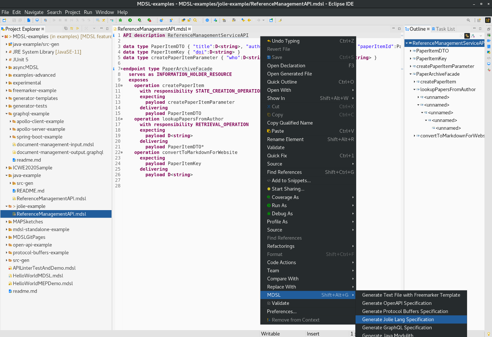

[Tools Overview](./../tools), [OpenAPI](./open-api), [Protocol Buffers](./protocol-buffers), [GraphQL](./graphql), [Java](./java), [Freemarker templating](./freemarker), [AsyncAPI](./async-api)

Jolie Specification Generator
=============================

The [Jolie](https://www.jolie-lang.org/) generator is invoked in the same way as the other generators. It creates a single Jolie file that contains both type information, a service interface and an input port. A corresponding client can easily be developed, but is not generated yet.

Note that Jolie comes with a tool called `jolie2wsdl`, which can convert the interface into a WSDL port type and XML Schema for the data types. A ready-to-execute command is generated into the Jolie specification as a comment (appearing at the bottom of the file).

## Usage
You can generate the Jolie specification out of an MDSL model by using the MDSL [Eclipse plugin](./../tools#eclipse-plugin) or our [CLI](./../tools#command-line-interface-cli-tools).

In Eclipse, you find the generator in the MDSL context menu:

<a href="./../media/eclipse-jolie-generator-context-menu.png"></a>

If you work with the CLI, the following command generates the Jolie specification:

```bash
./mdsl -i model.mdsl -g jolie
```

_Hint:_ Both tools generate the Graphql file into the `src-gen` folder which is located in the projects root directory (Eclipse) or the directory from which the `mdsl` command has been called (CLI). Both tools create the directory automatically in case it does not already exist.

## Example
The following example illustrates what the generator produces for an exemplary MDSL contract.

You find the complete sources (incl. generated `*.ol` (Jolie) file) of this example [here](https://github.com/Microservice-API-Patterns/MDSL-Specification/tree/master/examples/jolie-example).

We use the following MDSL model which was an outcome of this [blogpost](https://ozimmer.ch/practices/2020/06/10/ICWEKeynoteAndDemo.html) to illustrate our generator outputs:

```
API description ReferenceManagementServiceAPI

data type PaperItemDTO { "title":D<string>, "authors":D<string>, "venue":D<string>, "paperItemId":PaperItemKey }
data type PaperItemKey { "doi":D<string> }
data type createPaperItemParameter { "who":D<string>, "what":D<string>, "where":D<string> }

endpoint type PaperArchiveFacade
  serves as INFORMATION_HOLDER_RESOURCE
  exposes
    operation createPaperItem
      with responsibility STATE_CREATION_OPERATION
      expecting
        payload createPaperItemParameter
      delivering
        payload PaperItemDTO
    operation lookupPapersFromAuthor
      with responsibility RETRIEVAL_OPERATION
      expecting
        payload D<string>
      delivering
        payload PaperItemDTO*
    operation convertToMarkdownForWebsite
      expecting
        payload PaperItemKey
      delivering
        payload D<string>
```

For the MDSL contract above the generator produces the following `*.ol` file:

```jolie
// API name: ReferenceManagementServiceAPI

type PaperItemDTO {
  anonymous7: void { title: string /* data type role: D */ authors: string /* data type role: D */ venue: string /* data type role: D */ paperItemId: PaperItemKey } 
}

type PaperItemKey {
  anonymous8: void { doi: string /* data type role: D */ } 
}

type createPaperItemParameter {
  anonymous9: void { who: string /* data type role: D */ what: string /* data type role: D */ where: string /* data type role: D */ } 
}

// operation responsibility: RETRIEVAL_OPERATION
type lookupPapersFromAuthorRequestDTO {
  anonymous3: string /* data type role: D */ 
}

type lookupPapersFromAuthorResponseDTO {
  anonymous4[0,*]: PaperItemDTO 
}

// operation responsibility: STATE_CREATION_OPERATION
type createPaperItemRequestDTO {
  anonymous1: createPaperItemParameter 
}

type createPaperItemResponseDTO {
  anonymous2: PaperItemDTO 
}

// operation responsibility: undefined
type convertToMarkdownForWebsiteRequestDTO {
  anonymous5: PaperItemKey 
}

type convertToMarkdownForWebsiteResponseDTO {
  anonymous6: string /* data type role: D */ 
}

type SOAPFaultMessage {
  code: int
  text: string
  actor: string
  details: string
}

// interface/endpoint role: INFORMATION_HOLDER_RESOURCE
interface PaperArchiveFacade {
RequestResponse:
  createPaperItem( createPaperItemRequestDTO )( createPaperItemResponseDTO ),
  lookupPapersFromAuthor( lookupPapersFromAuthorRequestDTO )( lookupPapersFromAuthorResponseDTO ),
  convertToMarkdownForWebsite( convertToMarkdownForWebsiteRequestDTO )( convertToMarkdownForWebsiteResponseDTO ),
}

inputPort PaperArchiveFacadePort {
  location: "socket://localhost:8080" 
  protocol: soap
  interfaces: PaperArchiveFacade
}

// sample conversion to WSDL/SOAP:
// jolie2wsdl --namespace "http://tbc.org" --portName PaperArchiveFacadePort --portAddr "localhost:8080" --outputFile EndToEndDemoPaperArchiveFacade.wsdl EndToEndDemo.ol
// The WSDL could be viewed/analyzed at: https://www.wsdl-analyzer.com/upload


main
{
  nullProcess
}
```

You find the complete sources (incl. generated Jolie file) of this example [here](https://github.com/Microservice-API-Patterns/MDSL-Specification/tree/master/examples/jolie-example).

## Jolie to WSDL and XML Schema

Run this command (that comes with Jolie) to convert the Jolie port (and interface) into a WSDL port (and port type):

`jolie2wsdl --namespace "http://tbc.org" --portName [inputPortName] --portAddr "localhost:8080" --outputFile [wsdlFileName] [jolieFileName]` 

See above for an example.

The generated WSDL can then be validated and viewed online on this website: [Analyze & Compare WSDLs](https://www.wsdl-analyzer.com/).


# Other Generators
Also checkout our other generators:

* [OpenAPI generator](./open-api)
* [Protocol Buffers generator](./protocol-buffers)
* [GraphQL generator](./graphql)
* [Java generator](./java)
* [Arbitrary textual generation with Freemarker](./freemarker)

# Site Navigation

* Back to [tools page](./../tools).
* [Quick reference](./../quickreference) and [tutorial](./../tutorial). 
* Language specification: 
    * Service [endpoint contract types](./../servicecontract) and [data contracts (schemas)](./../datacontract). 
    * [Bindings](./../bindings) and [instance-level concepts](./../optionalparts). 
* Back to [MDSL homepage](./../index).

*Copyright: Olaf Zimmermann, 2020-2022. All rights reserved. See [license information](https://github.com/Microservice-API-Patterns/MDSL-Specification/blob/master/LICENSE).*
