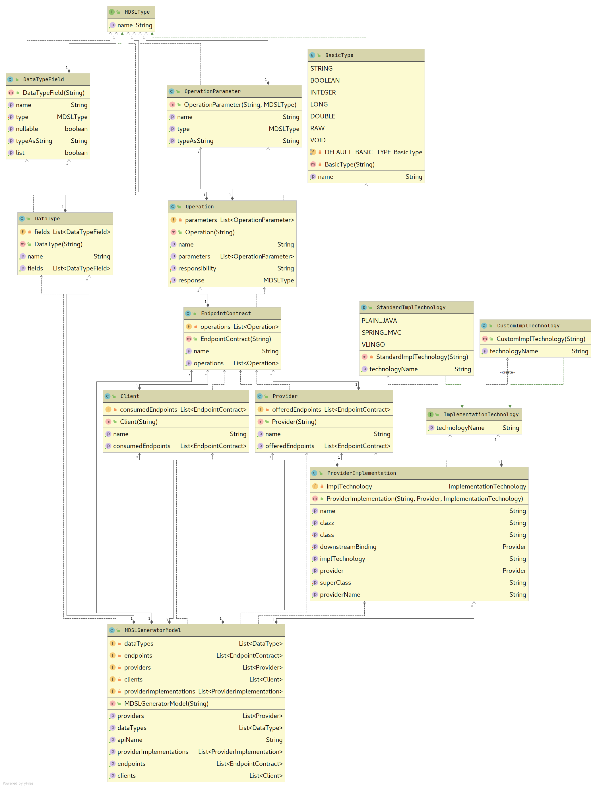

MDSL Tools: Users Guide
=======================

<!-- from top-level index page/readme:
### Installation in Eclipse

 * Update site: [https://microservice-api-patterns.github.io/MDSL-Specification/updates/](https://microservice-api-patterns.github.io/MDSL-Specification/updates/)
 * The grammar can be found in the `dsl-core` project (more precisely, in the `io.mdsl./src/io.mdsl` folder of this project): [public](https://github.com/Microservice-API-Patterns/MDSL-Specification/blob/master/dsl-core/io.mdsl/src/io/mdsl/APIDescription.xtext) and [private](https://github.com/Microservice-API-Patterns/MDSL-Specification/blob/master/dsl-core/io.mdsl/src/io/mdsl/APIDescription.xtext) repository.

### Direct links into repository

* [Full grammar](https://github.com/Microservice-API-Patterns/MDSL-Specification/blob/master/dsl-core/io.mdsl/src/io/mdsl/APIDescription.xtext)
* [Examples](https://github.com/Microservice-API-Patterns/MDSL-Specification/blob/master/tree/master/examples)
-->

At present, two types of MDSL tools are available: 

* Command Line Interface (CLI) tools: API Linter (validation), technology-specific contract generation 
* Eclipse Plugin: editor, API Linter (validation), technology-specific contract generation


## Command Line Interface (CLI) Tools

The CLI tools can  validate MDSL files and call our generators from the command line. When calling `./mdsl` (or `mdsl.bat` in Windows), the CLI shows you the available parameters:

```text
usage: mdsl
 -f,--outputFile <arg>   The name of the file that shall be generated
                         (only used by Freemarker generator, as we cannot
                         know the file extension).
 -g,--generator <arg>    The generator you want to call. Use one of the
                         following values: oas (Open API Specification),
                         jolie (Jolie), text (arbitraty text file by using
                         a Freemarker template), proto (Protocol Buffers),
                         graphql (GraphQL Schemas), gen-model-json
                         (Generator model as JSON (exporter)),
                         gen-model-yaml (Generator model as YAML
                         (exporter))
 -h,--help               Prints this message.
 -i,--input <arg>        Path to the MDSL file for which you want to
                         generate output.
 -o,--outputDir <arg>    The output directory into which the generated
                         files shall be written. By default files are
                         generated into the execution directory.
 -t,--template <arg>     Path to the Freemarker template you want to use.
                         This parameter is only used if you pass 'text' to
                         the 'generator' (-g) parameter.
```

Please refer to the [readme of the DSL core project](https://github.com/Microservice-API-Patterns/MDSL-Specification/tree/master/dsl-core/README.md) and the [CLI package readme](https://github.com/Microservice-API-Patterns/MDSL-Specification/tree/master/dsl-core/io.mdsl.cli) for  more information.


## Eclipse Plugin

### MDSL Editor
The MDSL Eclipse plugin provides editing support (syntax highlighting, auto completion, etc.) for our DSL. You can install the plugin in your Eclipse from the following update site:

[https://microservice-api-patterns.github.io/MDSL-Specification/updates/](https://microservice-api-patterns.github.io/MDSL-Specification/updates/)

Once you have installed the plugin successfully, the MDSL editor should open for any file that ends with `.mdsl`. You can create one and copy-paste the above hello world example, or find additional examples [in this folder](https://github.com/Microservice-API-Patterns/MDSL-Specification/tree/master/examples).

If you want to check whether the plugin has installed successfully, you can go to the Eclipse "Help" menu, select "About Eclipse IDE" and then "Installation Details". Two MDSL entries should be there.


### API Linter 
The API Linter comes with the MDSL Editor as well as the CLI (see above); every time a file is saved or parsed, a number of validation rules and some simple metrics are evaluated and the results displayed in the Problems view of Eclipse.

In addition to the usual editor features such as syntax highlighting, completion and syntax checking, it implements a few simple semantic validators (as a basic *API Linter* demonstrator):

* The modeler is warned about incomplete and unsuited data types such as `P` and `ID<bool>`.
* The constraints of the message exchange patterns such as REQUEST_REPLY, ONE_WAY and NOTIFICATION are validated (if specified). For instance, a REQUEST_REPLY must define a request and a response message by definition.
* Some MAP pattern decorator combinations are checked and warned about (for instance, a COMPUTATION_FUNCTION in an INFORMATION_HOLDER_RESOURCE is a modeling smell).
* The number of operations per endpoint is reported; if is likely that the endpoint cannot be mapped to OpenAPI due to a large amount of operations, the user is warned.
<!-- TODO (v4.2) check whether there are more now -->

An example that features all validators in action can be found in the examples folder of the repository: [`APILinterTestAndDemo.mdsl`](https://github.com/Microservice-API-Patterns/MDSL-Specification/blob/master/examples/APILinterTestAndDemo.mdsl).
The validation of this MDSL file yields the following errors, warnings and information messages (among others):
<a target="_blank" href="/media/api-linter-example.png"></a>


### Generators

In the MDSL Editor, you can invoke the following generators from the "MDSL" entry in the context menu:

* [Generate OpenAPI Specification](./generators/open-api)
* [Generate Protocol Buffers Specification](./generators/protocol-buffers)
* [Generate GraphQL Schema](./generators/graphql)
* [Generate Jolie Lang(uage) Specification](./generators/jolie)
* [Generate Java «Moduliths» Code](./generators/java)
* [Generate Text File with Freemarker Template](./generators/freemarker)

These generator features are also available in the CLI (see above).

#### Generator Model for Freemarker Templating and Model Exports
To ease code generation with the [template-based generator](./generators/freemarker), we provide an intermediate model. The following class diagram illustrates it:

<a href="./media/mdsl-generator-model.png" target="_blank"></a>

This model can also be exported for offline processing (for instance, to feed other tools): 

* Export Generator Model as JSON 
* Export Generator Model as YAML

*Note*: This feature is not yet complete, and the model API subject to change at any time. We do use it internally in the [GraphQL schema](./graphql) and [Java](./java) generators, so it has reached a certain level of maturity and test coverage. That said, it also has some known limitations; for instance, the output can be rather verbose and partially redundant (input depending, of course). 

#### AsyncAPI (technology preview)

This generator uses a different model management technology internally, and is run every time an MDSL file is saved. It is not available via a context menu.

See [readme in this examples folder](https://github.com/Microservice-API-Patterns/MDSL-Specification/tree/master/examples/asyncMDSL) for further instructions.


# Site Navigation

* [Quick reference](./quickreference) and [tutorial](./tutorial). 
* Language specification: 
    * Service [endpoint contract types](./servicecontract) and [data contracts (schemas)](./datacontract). 
    * [Bindings](./bindings) and [instance-level concepts](./optionalparts). 
* Back to [MDSL homepage](./index).

*Copyright: Olaf Zimmermann, 2018-2020. All rights reserved. See [license information](https://github.com/Microservice-API-Patterns/MDSL-Specification/blob/master/LICENSE).*

<!-- *EOF* -->