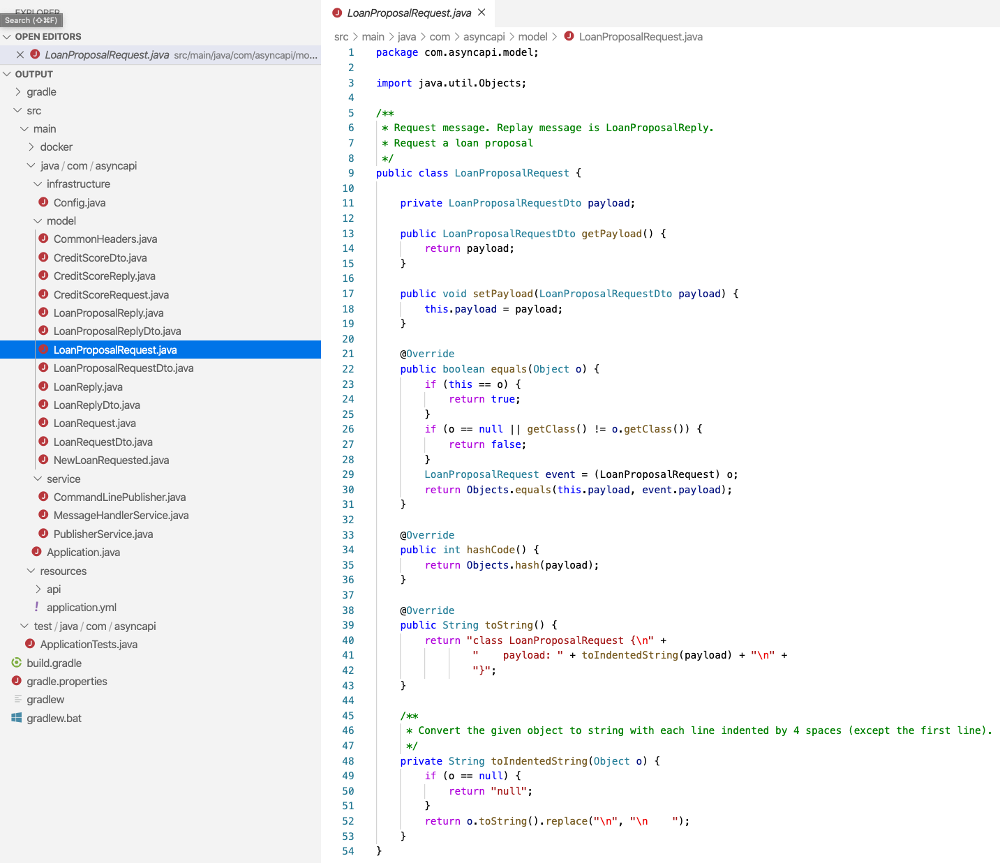

# AsyncMDSL extension (DSL and Eclipse plugin)

*Important note*: This technology preview, contributed by Giacomo de Liberali in his master thesis project at University of Pisa, demonstrates how MDSL can be extended and used to describe channels and endpoints in [queue-based messaging](https://www.enterpriseintegrationpatterns.com/patterns/messaging/Introduction.html).

## Proposed language extension

The language reference for the extensions can be found in the [master thesis report](https://etd.adm.unipi.it/t/etd-06222020-100504/). <!-- TODO include or link to it; externalize some parts? -->

## Eclipse plugin
See [this page](https://microservice-api-patterns.github.io/MDSL-Specification/tools) for general information and installation instructions for the MDSL editor, API linter and generators.

The prototypical MDSL to AsyncAPI generator runs automatically once a Java project contains  a `*.mdsl` file which contains no errors (the action will be moved to the MDSL context-menu). The generator produces a `.yaml` file in the `src-gen` folder.

To test the validity of the generated AsyncAPI document, you copy-paste it into the [AsyncAPI playground](https://playground.asyncapi.io/) or run the `async-api-generator` tool:

```bash
# assuming `asyncapi.yaml` file exists in the current working directory
docker run --rm -it \
    -v ${PWD}/asyncapi.yaml:/app/asyncapi.yml \
    -v ${PWD}/output:/app/output \
    asyncapi/generator -o ./output asyncapi.yml @asyncapi/html-template --force-write
```
This command will run the `async-api-generator` inside a Docker container and put the generated output in a folder named `output` in the current directory (the same directory as the level of the command line from which the Docker command has been launched). The `async-api-generator` can take as parameter the name of the template it has to generate. It can be one of the following:

- @asyncapi/html-template
- @asyncapi/markdown-template
- @asyncapi/nodejs-template
- @asyncapi/nodejs-ws-template
- @asyncapi/java-spring-template
- @asyncapi/java-spring-cloud-stream-template
- @asyncapi/python-paho-template

## Known limitations

* AsyncMDSL provides a syntax to handle multiple brokers with different Channels to declare. At present, the resulting AsyncAPI specification is not written to multiple files. The generated AsyncAPI specification therefore acts as if all brokers support all interfaces.
* Using the name `Null` for data types will result in an invalid AsyncAPI document.
* See [thesis report](https://giacomodeliberali.com/thesis/UNIPI-AsyncMDSL-MasterThesis-2020-GiacomoDeLiberali.pdf) for further information.


## Generation demo
Steps to generate an example code skeleton:

- open an Eclipse instance
- create a new empty Java project
- add the [`loan-broker-example.mdsl`](loan-broker-example.mdsl) file in the root of that project
- as soon as Eclipse asks for converting the project to a *Xtext* based project, click "Yes"
    
At this point the AsyncAPI generator should have run and created a `src-gen` folder in the root path of the project. This folder should contain a file named `loan-broker-example-asyncapi.yaml`. At this point (assuming you have Docker installed and running, and work in a Unix environment):

- open a terminal inside the `src-gen` folder
- run
    ```bash
    docker run --rm -it \
        -v ${PWD}/loan-broker-example-asyncapi.yaml:/app/asyncapi.yml \
        -v ${PWD}/output:/app/output \
        asyncapi/generator -o ./output asyncapi.yml @asyncapi/java-spring-template --force-write
    ```

Once the generation is complete you should see an `output` folder inside the `src-gen` folder that contains a Java Spring-based application skeleton that looks like the following:



## Useful links

- [AsyncAPI Playground](https://playground.asyncapi.io/)
- [Microservice API Patterns](https://microservice-api-patterns.org/)
- [Patterns and Best Practices for Enterprise Integration](https://www.enterpriseintegrationpatterns.com/)


Feedback on this technology preview is welcome! Email us, or open an issue in GitHub. 